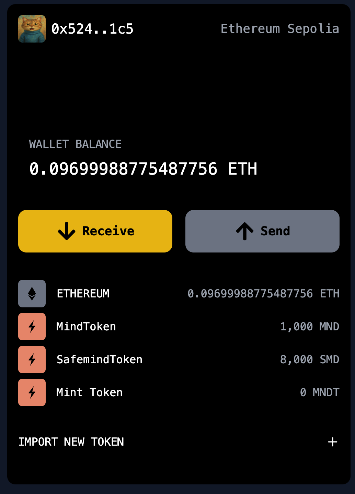

# Lite Vault



**Lite Vault** is a lightweight, browser-based, EVM-compatible crypto wallet built purely on the frontend using **Vite + React**. It is designed as a fun and experimental project to explore modern cryptographic storage techniques, client-side encryption, and seamless EVM chain interaction, all without relying on backend infrastructure.

> ⚠️ **Disclaimer:** This project is **not intended for production use** or to hold real funds. It is built purely for educational and development purposes.

---

## ✨ Features

-  **Fully Frontend**: No backend or server – all logic runs in the browser.
-  **Mnemonic Encryption**: Wallet mnemonics are encrypted using a password-derived key and stored securely in the browser's **IndexedDB**.
-  **Wallet Management**:
  - Create new EVM-compatible wallets.
  - Import existing wallets via mnemonic phrase.
- 🧪 **Testnet Support**:
  - Ethereum Sepolia
  - Lisk Sepolia
-  **Custom Tokens**:
  - Import any ERC-20 token manually.
-  **Security-first Design**:
  - Password-based key derivation and AES encryption for mnemonics.
  - Local-only storage (never sent over the network).

---

## Tech Stack

- [React](https://reactjs.org/)
- [Vite](https://vitejs.dev/)
- [Ethers.js](https://docs.ethers.io/)
- [IndexedDB](https://developer.mozilla.org/en-US/docs/Web/API/IndexedDB_API)
- [Crypto APIs (Web Crypto)](https://developer.mozilla.org/en-US/docs/Web/API/Web_Crypto_API)
- [Wagmi](https://wagmi.sh)

---

## Getting Started

### Prerequisites

- Node.js ≥ 18
- npm or yarn

### Installation

```bash
# Clone the repository
git clone https://github.com/collinsadi/litevault.git
cd litevault

# Install dependencies
npm install

# Run the development server
npm run dev
```

---

## How It Works

###  Mnemonic Encryption Flow

1. User enters a password on wallet creation or import.
2. A **PBKDF2-derived key** is generated from the password.
3. The mnemonic is **AES-encrypted** using the derived key.
4. The encrypted mnemonic is stored in **IndexedDB**.
5. On future access, the mnemonic is decrypted using the correct password.

### IndexedDB Storage

- The wallet uses `idb` or native IndexedDB APIs to store encrypted wallet data.
- All operations happen on the client – no data leaves the browser.

### Token Importing

- Users just have to input token address and the details will be automatically fetched

- The token is then integrated into the wallet interface.

---

## Supported Networks

- **Ethereum Sepolia Testnet**
- **Lisk Sepolia Testnet**

(You can extend support to other EVM-compatible chains easily.)

---

## Potential Features / Contributions

New ideas welcomed! Here are some potential future enhancements:

- Transaction History Viewer
- dApp Connector (e.g., WalletConnect or custom provider)
- QR Code-based Wallet Import / Export
- Token Price Fetching via CoinGecko API
- Hardware Wallet Integration
- Mnemonic Backup & Restore via Encrypted Files

Feel free to fork or open a PR with your suggestions!

---

## Contribution Guide

1. Fork the repo.
2. Create your feature branch: `git checkout -b feature/awesome-feature`
3. Commit your changes: `git commit -am 'Add awesome feature'`
4. Push to the branch: `git push origin feature/awesome-feature`
5. Open a Pull Request 🚀

---


## A Note from the Author

> This project was built for fun, learning, and experimentation. It showcases how a fully client-side crypto wallet can be built with modern tools. Please **do not use it for real assets**. For feedback, feel free to open issues or connect on GitHub.

